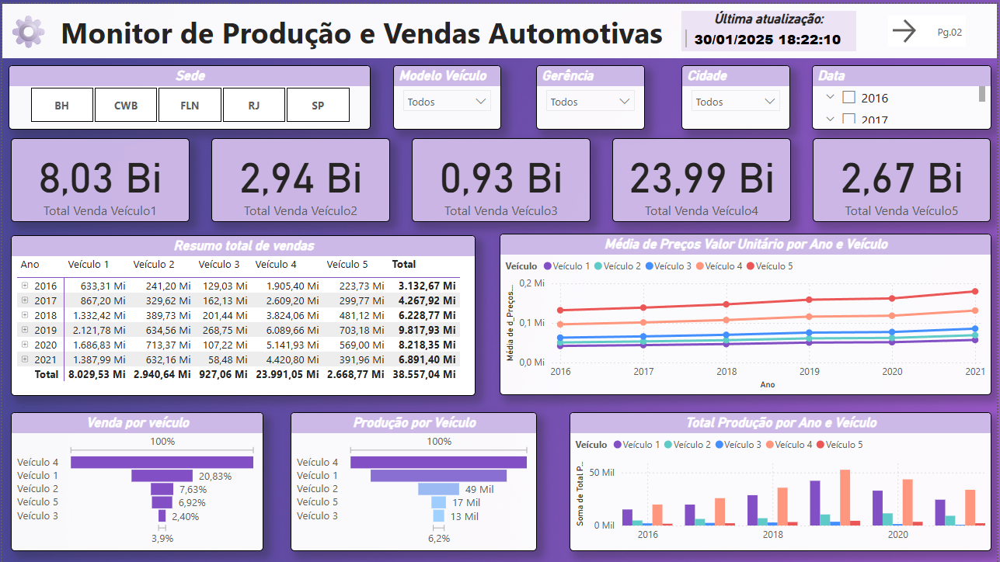
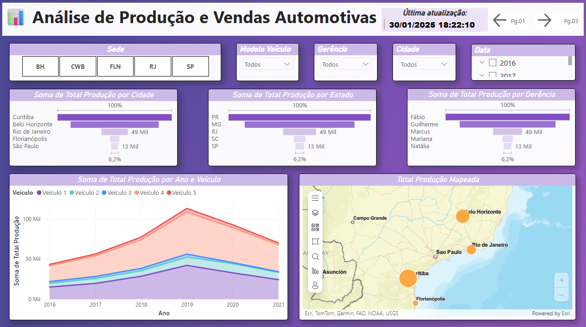
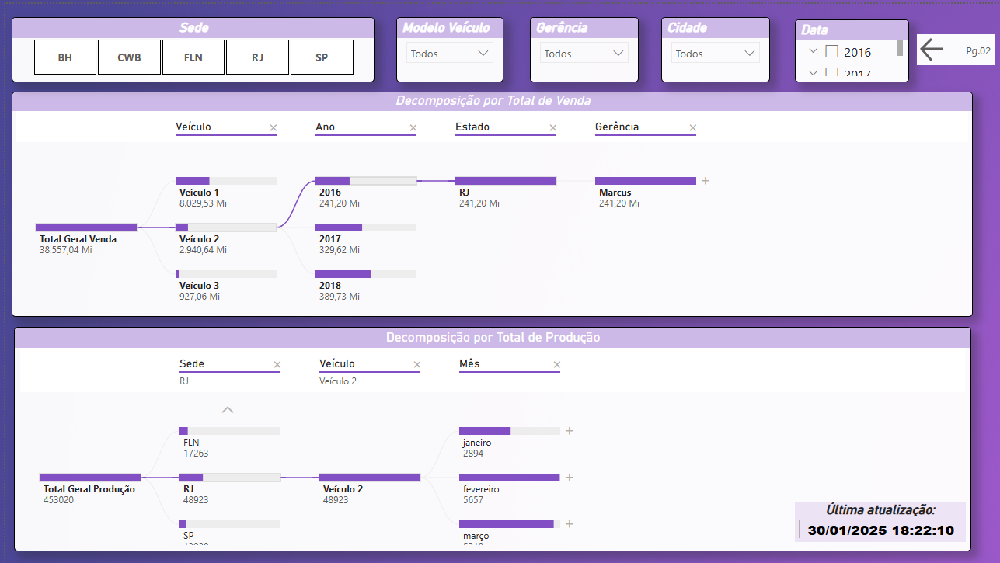

# Análise de Produção e Vendas Automotivas

Dashboard em Power BI para análise de produção e vendas de veículos, cruzando indicadores por modelo de veículo, região (sede, gerência, cidade) e período. Construído com modelagem em esquema estrela e medidas DAX.

## Problema de negócio

A empresa precisava entender se o volume de produção estava alinhado à demanda de vendas por região e modelo de veículo, e identificar onde havia gargalos ou excedentes.

## Estrutura dos dados

O modelo segue um esquema estrela, com uma tabela fato e dimensões de apoio:

- **`f_Produção`** (fato) — registros de produção e vendas
- **`d_Veículo`** — dimensão de modelos de veículo
- **`d_Local`** — dimensão de localização (sede, gerência, cidade)
- **`d_Preços`** — dimensão de preços/valores unitários
- **`d_calendário`** — dimensão de tempo
- **`d_atualização`** — controle da data de última atualização dos dados
- **`_Medidas`** — tabela dedicada às medidas DAX do relatório

## Estrutura do dashboard

O relatório tem 3 páginas:

### 1. Resumo
Visão executiva com cards de KPI, tabela dinâmica de vendas, produção total por ano e veículo, evolução do preço médio unitário por ano e veículo, e funis comparando venda e produção por modelo. Filtros por sede, modelo, gerência, cidade e data.

### 2. Análise de Dados
Aprofundamento com funis complementares, gráfico de área empilhada mostrando evolução no tempo, e um mapa geográfico com a produção mapeada por localização.

### 3. Decomposição Venda/Produção
Duas árvores de decomposição interativas, permitindo detalhar o total de vendas e o total de produção por qualquer combinação de dimensões (veículo, local, período).

## Principais insights

- Veículo 4 domina o portfólio: sozinho representa 62% da receita total (R$ 23,99 Bi de um total geral de R$ 38,56 Bi), mais que a soma dos outros 4 modelos juntos.
- Preço alto não significa volume alto: o Veículo 5 tem o maior preço médio unitário do portfólio, mas responde por apenas ~7% da receita total. Já o Veículo 4, com preço um pouco menor, compensa com volume muito superior e por isso lidera o faturamento, indicando que a estratégia de receita da empresa é puxada por volume, não por ticket médio.
- Pico em 2019, queda nos anos seguintes: a receita total cresceu de R$ 3,13 Bi (2016) para R$ 9,82 Bi (2019), alta de ~213% em 4 anos, mas caiu para R$ 6,89 Bi em 2021, uma retração de ~30% frente ao pico. A produção segue o mesmo padrão no gráfico de área, sugerindo desaceleração conjunta de produção e vendas após 2019 (vale investigar se há relação com o cenário de 2020).
- Veículo 3 é o modelo menos relevante da linha: menor receita em todos os anos, apenas 2,4% de participação no total, e queda de ~71% entre 2018 (R$ 201 Mi) e 2021 (R$ 58 Mi), candidato natural a revisão de portfólio.
- Concentração geográfica em Curitiba/PR: a cidade e o estado lideram disparadamente a produção nacional, à frente de Belo Horizonte e Rio de Janeiro. Chama atenção São Paulo aparecer com a menor produção mapeada, apesar de ser historicamente o maior polo automotivo do país, um ponto interessante para explorar em uma entrevista (ociosidade de capacidade? decisão estratégica de descentralização?).

## Tecnologias utilizadas

- **Power BI Desktop** — modelagem, visualizações e publicação
- **DAX** — medidas calculadas (tabela `_Medidas`)
- **Modelagem dimensional** — esquema estrela (fato + dimensões)
- **Power Query** — tratamento e transformação dos dados de origem

## Como visualizar

- Arquivo original: [`dashboard.pbix`](./Análise-de-Produção-e-Vendas-Automotivas.pbix) — abra no Power BI Desktop (gratuito) para navegar de forma interativa
- Versão estática: [`Dashboard.pdf`](./Dashboard.pdf) — para visualização rápida sem precisar instalar o Power BI

## Autor

**Bertrand Otoniel Pereira Carvalho**
[LinkedIn](https://www.linkedin.com/in/bertrand-otoniel/) · [GitHub](https://github.com/Bertrand-Otoniel-Pereira-Carvalho)
